# Data flow through the sensor module

The Sensor Module shall acquire readings from the hardware sensor, preprocess them, and transmit the result to the analysis subsystem. Out-of-range readings shall be surfaced as warnings without interrupting the stream.

## Data flow

Source: [`req-data-flow.mmd`](req-data-flow.mmd). To re-render after editing, run `make` at the repo root.
