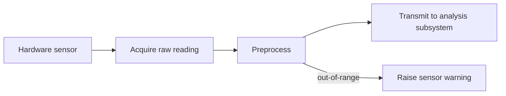

# Data flow through the sensor module

The Sensor Module shall acquire readings from the hardware sensor, preprocess them, and transmit the result to the analysis subsystem. Out-of-range readings shall be surfaced as warnings without interrupting the stream.

## Data flow

Mermaid source

