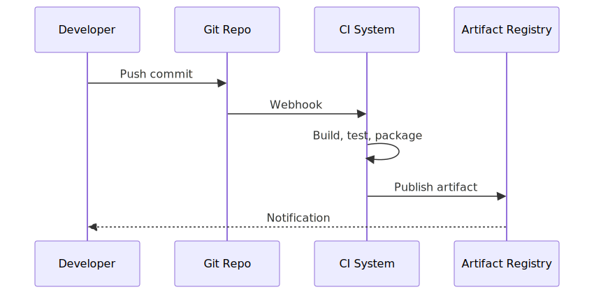

# Build pipeline

The build pipeline transforms source commits into versioned release artifacts via four stages: Build, Test, Package, Release.

## Stages

Source: [`spec-build-pipeline.mmd`](spec-build-pipeline.mmd).

## Trigger flow

A push to the source repository triggers the pipeline via webhook. The CI system runs the stages and publishes the result to the artifact registry.

Source: [`spec-build-pipeline-trigger.mmd`](spec-build-pipeline-trigger.mmd).
