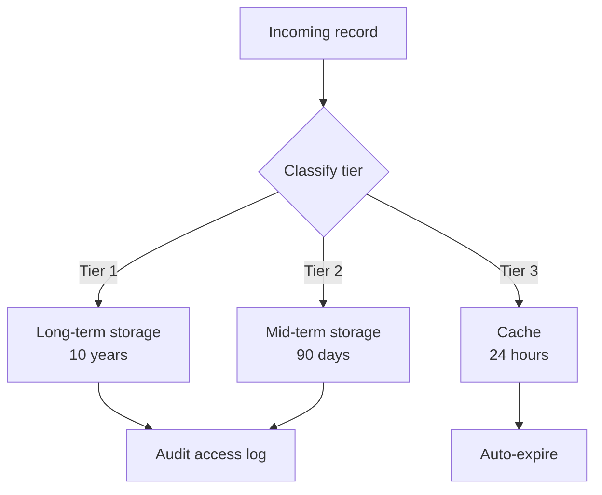
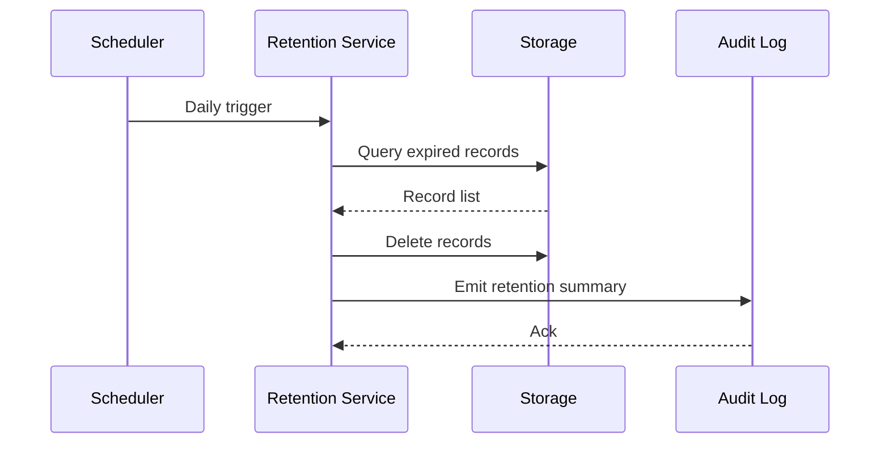

# Data retention policy

The Data Retention Service expires records based on their classification tier. Tier-1 records (audit logs, regulatory submissions) are retained for 10 years. Tier-2 records (operational logs) for 90 days. Tier-3 records (cache, ephemeral metrics) for 24 hours.

## Expiry sequence

The expiry job runs daily, drops records past their retention window, and emits a summary event for compliance audit.

