# Sensor state machine

The sensor module is implemented as a state machine with four states: Idle, Sampling, Fault, and a transient initialization state.

## State diagram

Source: [`spec-sensor-state-machine.mmd`](spec-sensor-state-machine.mmd).

## Notes

- `out-of-range` is detected during Preprocess (see `req-data-flow`).
- `reset()` clears the fault and returns to Idle without re-initializing the sensor.
